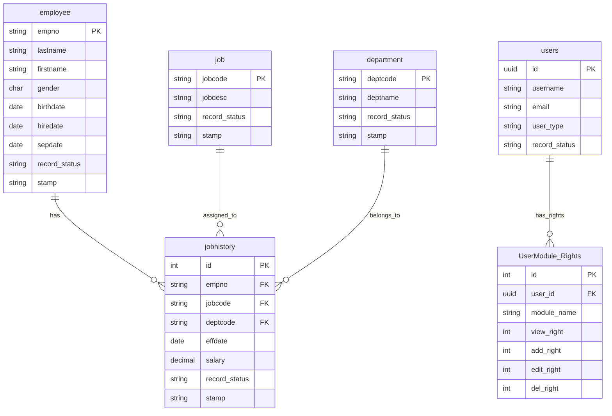

# HopeDB Entity Relationship Diagram (ERD)

```mermaid
erDiagram
    employee {
        string empno PK
        string lastname
        string firstname
        char gender
        date birthdate
        date hiredate
        date sepdate
        string record_status
        string stamp
    }
    department {
        string deptcode PK
        string deptname
        string record_status
        string stamp
    }
    job {
        string jobcode PK
        string jobdesc
        string record_status
        string stamp
    }
    jobhistory {
        int id PK
        string empno FK
        string jobcode FK
        string deptcode FK
        date effdate
        decimal salary
        string record_status
        string stamp
    }
    users {
        uuid id PK
        string username
        string email
        string user_type
        string record_status
    }
    UserModule_Rights {
        int id PK
        uuid user_id FK
        string module_name
        int view_right
        int add_right
        int edit_right
        int del_right
    }

    employee ||--o{ jobhistory : "has"
    job ||--o{ jobhistory : "assigned_to"
    department ||--o{ jobhistory : "belongs_to"
    users ||--o{ UserModule_Rights : "has_rights"
```
